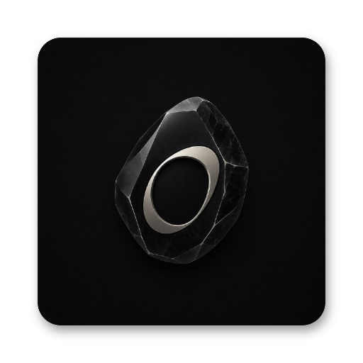
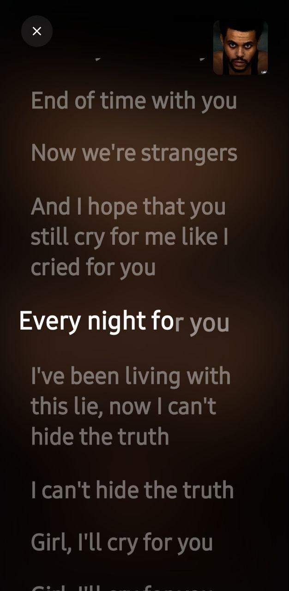
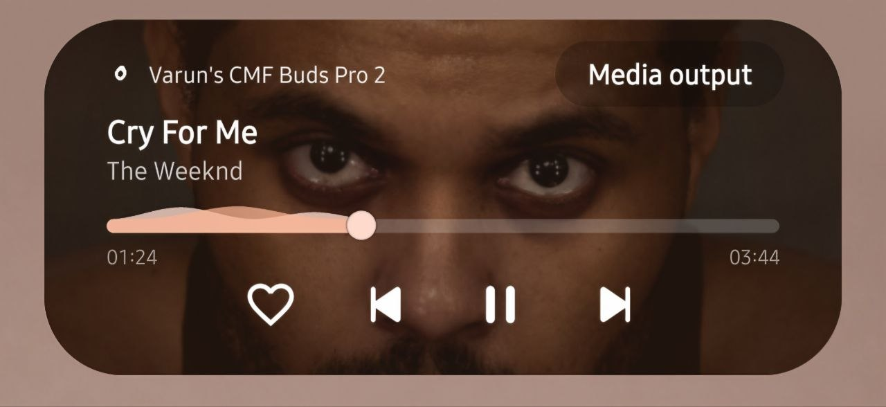

  

  # Obsidian Music Player 🎵✨

  

    <strong>A stunning, modern, and perfectly crafted Android music player built with Jetpack Compose.</strong>
  

  

    
    
    
  

 

Obsidian Music is a beautifully crafted, feature-rich audio player for Android. Designed with absolute attention to detail, it leverages the latest Android technologies like **Jetpack Compose** and **Media3 (ExoPlayer)** to deliver a flawlessly smooth, immersive, and premium listening experience.

---

> [!WARNING]
> **Beta Notice:** This is our initial release! While there are no major critical bugs, you might encounter some minor glitches as we continuously polish and improve the app over time. 
> 
> 💬 **Have a feature request or found a bug?** [Join our Telegram Channel]( https://t.me/obsidianmusichelp ) to report issues, suggest features, and chat with the community!

---

## ✨ Features

- 🎨 **Gorgeous Compose UI:** A fluid, fully reactive user interface built 100% in Jetpack Compose using Material 3 design principles.
- 🌌 **Immersive Player Mode:** Edge-to-edge full-screen playback that gracefully hides the status bar and navigation elements for a distraction-free experience.
- 💬 **Real-Time Synced Lyrics:** Sing along with perfectly timed, word-by-word synced lyrics that flow seamlessly with the music.
- 🔔 **Native Media3 Notifications:** Flawless system integration! Features a perfectly tinted Android 13+ lock screen widget and Samsung dynamic Media Pill support, complete with custom `Like` and `Repeat` actions.
- ❤️ **Liked Songs & Playlists:** Build your ultimate library. Tap the heart to instantly save tracks to your library, and manage your own custom playlists with sleek, modern popups.
- ⏱️ **Sleep Timer:** Drift off to sleep with a customizable built-in sleep timer.
- 🚀 **Seamless Background Playback:** Powered by ExoPlayer and `MediaSessionService` for uninterrupted, battery-efficient background listening.

## 📸 Screenshots 

  <table>
    <tr>
      <td align="center"><b>Immersive Player</b></td>
      <td align="center"><b>Synced Lyrics</b></td>
      <td align="center"><b>Live Notification Pill</b></td>
    </tr>
    <tr>
      <td></td>
      <td></td>
      <td></td>
    </tr>
  </table>

## 🤝 Community & Support

Join our Telegram community for updates, feature requests, and to chat with other users!

👉 **[Join Obsidian Telegram](https://t.me/YOUR_TELEGRAM_LINK_HERE)**

---

  Built with ❤️ by an Android enthusiast.

